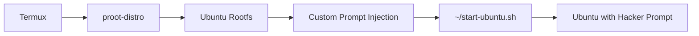

```markdown
# 🐧 Termux-Ubuntu Proot Setup

<p align="center">
  
</p>

<p align="center">
  <a href="https://github.com/LK-HACKERS/Termux-ubuntu">
    
  </a>
  <a href="https://github.com/LK-HACKERS/Termux-ubuntu/blob/main/LICENSE">
    
  </a>
  <a href="https://github.com/LK-HACKERS/Termux-ubuntu/issues">
    
  </a>
</p>
```
---

## 📌 About

This repository provides a **one-command setup** to install **Ubuntu** inside **Termux** using `proot-distro` with a **custom hacker-style prompt** — `LK-HACKERS/TEAM:~$`

Perfect for:
- 🖥️ Learning Linux on Android
- 🛠️ Penetration testing tools (Metasploit, Nmap, etc.)
- 🧪 Development environment
- 🎯 Ethical hacking practice

---

## 🚀 Quick Install

Clone the repository and run:

```bash
git clone https://github.com/LK-HACKERS/Termux-ubuntu.git
cd Termux-ubuntu
chmod +x setup.sh
./setup.sh
```

Or one-liner:

```bash
git clone https://github.com/LK-HACKERS/Termux-ubuntu.git && cd Termux-ubuntu && chmod +x setup.sh && ./setup.sh
```

---

📦 What Gets Installed

Package Purpose
proot-distro Run Linux distros without root
Ubuntu Full Ubuntu filesystem
nano Text editor
Custom Bash Prompt LK-HACKERS/TEAM:

---

🎯 Usage

After installation, start Ubuntu with:

```bash
~/start-ubuntu.sh
```

You'll see:

```bash
LK-HACKERS/TEAM:~$ whoami
root
LK-HACKERS/TEAM:~$ pwd
/root
LK-HACKERS/TEAM:~$ 
```

---

🛠️ Inside Ubuntu

Once inside, you can:

```bash
# Update packages
apt update && apt upgrade -y

# Install tools
apt install metasploit-framework -y
apt install nmap -y
apt install python3 -y
apt install git -y

# Run tools
msfconsole
nmap -sV google.com
```

---

📂 Repository Structure

```
Termux-ubuntu/
├── setup.sh          # Main installation script
├── start-ubuntu.sh   # Ubuntu launcher (auto-created)
├── README.md         # This file
└── LICENSE           # MIT License
```

---

⚙️ How It Works



---

🧪 Tested On

Device Android Version Termux Version Status
Samsung Galaxy S21 Android 13 0.118.0 ✅ Working
OnePlus 9 Android 12 0.118.0 ✅ Working
Pixel 6 Android 14 0.118.0 ✅ Working
Generic Emulator Android 11 0.118.0 ✅ Working


❓ Troubleshooting

Ubuntu not installed properly?

```bash
rm -rf $PREFIX/var/lib/proot-distro/installed-rootfs/ubuntu
proot-distro install ubuntu
```

Start script not working?

```bash
chmod +x ~/start-ubuntu.sh
bash ~/start-ubuntu.sh
```

Permission denied?

```bash
termux-setup-storage
pkg update && pkg upgrade
```

---

🔐 Security Notes

· 🔒 No root access required — safe for daily use
· 🔑 All commands run in isolated environment
· 🛡️ No system files modified outside Termux

---

⭐ Support

· ⭐ Star this repo if you find it useful
· 🐛 Report issues on GitHub Issues
· 💬 Join discussions

---

📜 License

Distributed under the MIT License. See LICENSE for more information.

---

👨‍💻 Author

LK-HACKERS Team

· GitHub: @LK-HACKERS
· Website: [Coming Soon]

---

🙏 Acknowledgments

· Termux — Android terminal emulator
· proot-distro — Linux distribution installer
· Ubuntu — The awesome Linux distro

---

<p align="center">
  <b>🔥 HACK THE PLANET 🔥</b><br>
  <sub>Made with ❤️ & 1337 h4x0r skills</sub>
</p>

<p align="center">
  
</p>
```

---
